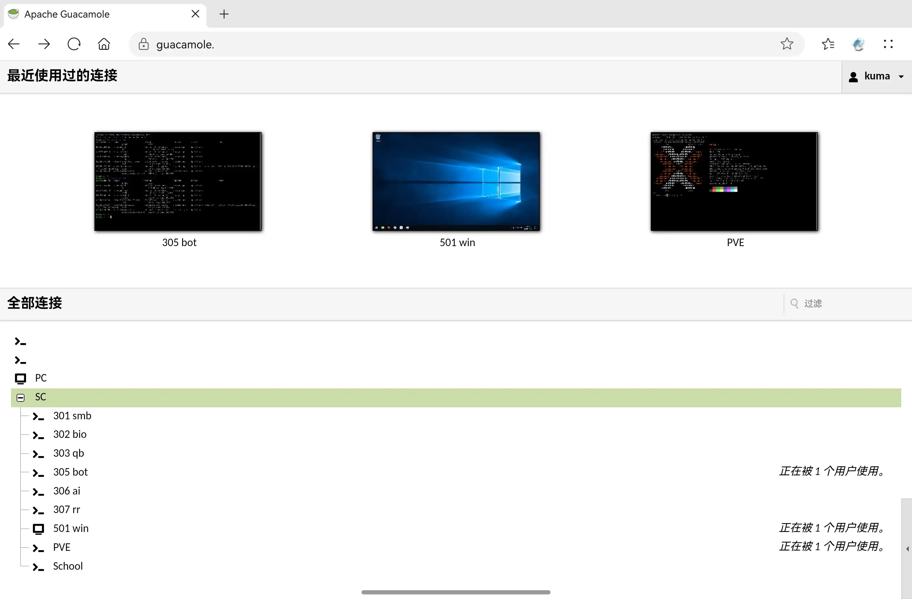
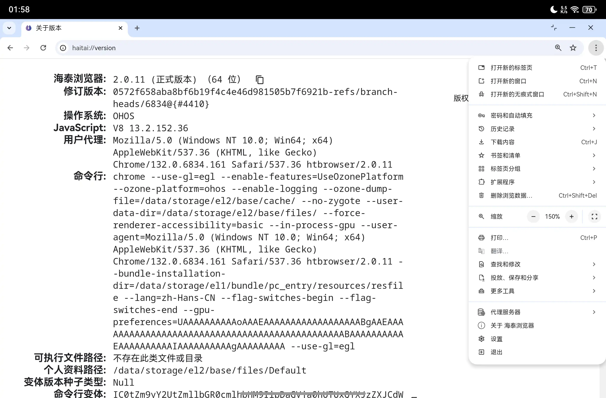

# HarmonyOS Eco Practice

华为鸿蒙生态替代最佳实践

Best Practice for Replacement of the Ecosystem of Huawei HarmonyOS NEXT

---

华为鸿蒙操作系统 (此处指 [HarmonyOS NEXT](https://en.wikipedia.org/wiki/HarmonyOS_5), 俗称「[纯血鸿蒙](https://zh.wikipedia.org/wiki/%E9%B8%BF%E8%92%99%E6%93%8D%E4%BD%9C%E7%B3%BB%E7%BB%9F5)」) 是使用鸿蒙微内核，去除Linux内核，仅支持鸿蒙系统的原生应用程序的操作系统。

由于该系统发布时间较短，生态系统较不完善，尤其缺乏海外企业开发的应用。虽然提供了安卓容器化环境[卓易通](https://www.droitong.com/)，但使用体验上仍一般。

本项目通过本人的使用经验，提供替代常用使用场景的最佳实践。针对的使用场景主要为桌面，对应的设备包括鸿蒙电脑 (MateBook) 和平板 (MatePad) 的多窗口模式。部分替代方案需要有一台服务器。

---

## 远程连接 Remote Connection

### Apache Guacamole

* 目标 Targets
  * Microsoft Remote Desktop
  * Termius
* **替代 Replacements**
  * **[Apache Guacamole](https://guacamole.apache.org)**
    * 类型：Web
    * 开源：是
    * 免费：是
* 评价 Reviews
  * 效果：完全替代
  * 操作难度：中
* 参考 References
  * https://krdesigns.com/articles/how-to-install-guacamole-using-docker-step-by-step
  * https://guacamole.apache.org/doc/gug/guacamole-docker.html
  * https://windgate.net/connect-your-lab-remotely-with-guacamole-rdp-to-windows-linux/

### Moonlight

* 目标 Targets
  * Microsoft Remote Desktop
* **替代 Replacements**
  * **[Moonlight](https://moonlight-stream.org)** **[App](https://appgallery.huawei.com/app/detail?id=com.xiaobai.moonlight)** [Source](https://github.com/likuai2010/moonlight-harmonyos)
    * 类型：原生
    * 开源：部分 (上架华为商店后版本更新未开源)
    * 免费：是
* 评价 Reviews
  * 效果：完全替代
  * 操作难度：简单

与 Windows 原生支持的RDP协议不同，Moonlight 类似于 TeamViewer 等第三方远程控制软件，在连接时物理机不会显示锁屏见面，而是直接同步远程操作。这有其优点（例如，不使用虚拟显示器，可方便修改分辨率，可支持睡眠等）和缺点（显示操作，在宿舍等公共环境有隐私顾虑）。Moonlight 专为游戏串流设计，在连接效果上介于微软远程桌面 (好) 和第三方远程桌面软件 (一般) 之间。

为了使用 Moonlight，需要先在 Windows 上安装 [Sunshine](https://github.com/LizardByte/Sunshine/releases/latest) 等服务端软件。连接前在被控端授权后即可控制，部分软件和游戏会自动识别 (如 Steam)，也可以单独添加App，但与直接控制无明显区别。

## 网页浏览 Web Browsing

* 目标 Targets
  * Google Chrome
* **替代 Replacements**
  * [**海泰浏览器**](https://appgallery.huawei.com/app/detail?id=com.haitai.htbrowser)
    * 类型：原生
    * 开源：否
    * 免费：是
* 评价 Reviews
  * 效果：基本替代
* 参考 References
  * https://zhuanlan.zhihu.com/p/1945613830722912366

基于 Chromium 的浏览器，去除谷歌服务，加入部分信创功能。[目前鸿蒙平台唯一桌面浏览器](https://www.haitaichina.com/hlhhmgmllqglhhmgmllq/index.htm)，支持插件等绝大多数 Chrome 支持的功能，桌面使用体验极佳，基本是官方或第三方 Chrome / Chromium 浏览器推出之前的唯一选择。当然，对于密码填充等敏感使用场景，仍建议使用官方浏览器或于其他平台完成。

## 文稿处理 Documents Processing

* 目标 Targets
  * Microsoft Office
* **替代 Replacements**
  * [**WPS Office**](https://appgallery.huawei.com/app/detail?id=cn.wps.office.hap)
    * 类型：原生
    * 开源：否
    * 免费：大部分功能
* 评价 Reviews
  * 效果：基本替代

## 其他 Others

这里列出一些其他替代项目。这些项目并不止替代鸿蒙生态这一目的，而是它们本身有更多、更合适的适用场景 (例如 clientless)。这些方案很多都要求一台服务器。

### 编程 Programming

* 通用
  * 目标：VS Code
    * [VS Code Web](https://vscode.dev)
    * [Code Server](https://github.com/coder/code-server)
* Python
  * 目标：PyCharm
    * [JupyterLab](https://jupyter.org)
* R
  * 目标：RStudio
    * [RStudio Server](https://posit.co/products/open-source/rstudio-server)
